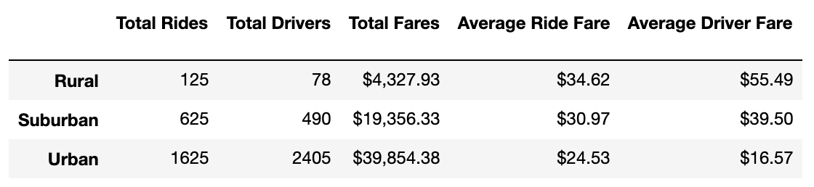
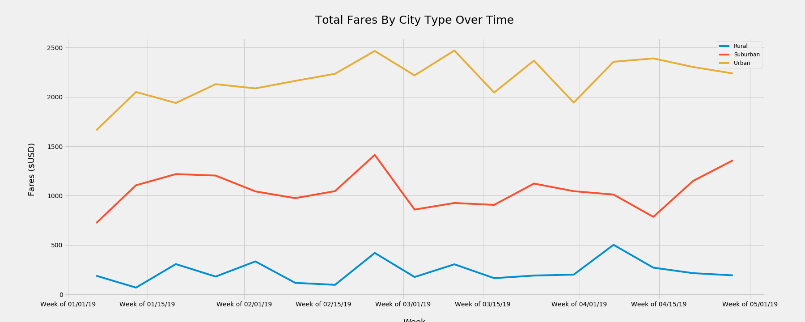

# PyBer - Rideshare Analysis
UC Berkeley Extension Data Analytics Boot Camp Module 5

Using MatPlotLib Version 3.1.3

---

## Purpose Statement & Results:

The purpose of this challenge was to merge and analyze two datasets generated by a ride sharing app, PyBer, in order to generate meaningful takeaways centered around the type of city -- rural, suburban, or urban. This type of analysis can help PyBer determine markets where they would like to expand, as well as to understand the needs of their customers in various geographic locations. 

In order to determine the differences between the different city types, we merged the two existing datasets--one that contained ride information, and another that contained city information. Then, we determined the number of drivers and rides per city type, grouping all the data into three categories: rural, suburban, and urban. We then calculated calculated the average fare that a driver in each city type recieved, as well as the average fare per ride. 

The results we obtained show a that it is more profitable to drive for PyBer in rural areas -- on average, drivers in rural areas received more money per ride ($34.62) and each of the 78 rural-area drivers received more money ($55.49) per driver that their suburban and urban counterparts. However, this is likely due to the fact that there are much more drivers in suburban and urban areas, diluting the market. Also, rural areas are more spread apart, resulting in longer rides and higher ride fares. 

In order to get an idea of total profitability for PyBer, we need to look at the total fares per city type over time. In order to accomplish this, we totaled the fares for each city type by week, and plotted the results on a multi-line graph, with a line for each of the three city types. 

From this chart, it is clear that, consistently, urban markets generate much higher fares than suburban and rural ones for any given week. This aligns with our "Total Fares" column in the table above: urban cities accounted for 1625 rides and fares totaling $39,854. On the other hand, rural cities only accounted for 125 rides, and $4,327 in revenue. 

While the averages we calculated provide a good snapshot of the differences between the three city types, we need to look at overall revenue to determine what is most profitable for PyBer as a whole.

---

## Challenges & Difficulties:

During this analysis, I ran into one issue while creating the first deliverable. I was unable to get the correct number of drivers for each city type. While my initial instinct told me that the numbers I was seeing was too high for the data set we had, I cross-checked the CSV file holding the raw data just to be sure by creating a pivot table and filtering my results down to see the number of drivers for each city type. 

While diagnosing the issue, I found that I was summing up the number of drivers by city type (using GroupBy()) for the merged, complete DataFrame. However, when I was looking at the CSV file, I was only looking at the one containing City Data. After realizing this, I changed the GroupBy() code to read the data from the City Data DataFrame rather than the merged DataFrame. This resolved my issue, and I got the correct values for my summary table.

---

## Take-Aways & Recommendations:

The results we obtained tell us two things: 
- It is more profitable to be a driver in a rural area, but the demand for rides is much lower.
- PyBer earns greater revenue in urban areas, but there are many drivers who have not completed any rides.

In order to better understand the differences between these city types, we need to filter out inactive drivers. As we can see in our DataFrame, there were 1,625 rides in urban cities, where there are 2,405 available drivers. This means that there are hundreds (if not more) of drivers who did not complete a single ride. In order to determine the true per-ride fare and per-driver fare, we need to only count those drivers who actually completed rides. 

Furthermore, I'd like to suggest two additional recommendations to better understand the relationship between city type and profitability:

1) Use ride duration data to determine which city type has longer rides on average, and the associated fare per minute for each city type. We could determine this by dividing the total fares for each city type by the total number of minutes for all the rides in each city type. Assuming that PyBer charges the same rate per minute for a ride regardless of city type, we would expect that rural areas (where travel times and distances between destinations are longer) will generate greater fares per ride than urban areas. To increase profitability, PyBer could vary the rate per minute for each city type, charging a higher rate per minute in urban areas. This would incentivize drivers in urban areas to drive more, as it currently may not be profitable for the drivers, who have to spend time in congested urban areas to get from one customer to the next, only to receive less money due to shorter ride durations.

This concept could also be applied to ride distance rather than duration. For this, we would need the total distance covered per ride, rather than the total time for each ride.

2) Use passenger age to determine the demographic of customers in each city type. In order to get this information, we can calculate the percentage of people in various age groups (18-25, 25-35, 35-45, 46-60, and 60+) for each city type. While ridesharing is a common method of transportation among younger generations, many older age groups  have not adopted it as readily. By using data on the customer demographics, we can determine the age group that PyBer's marketing team should be targeting within each city type. For example, an ad aimed at young people in a college town would be very different from an ad aimed at older customers in a rural area. 

By better understanding the customer demographics, PyBer can be more effective in the way they both market and execute the services that they provide.

---
